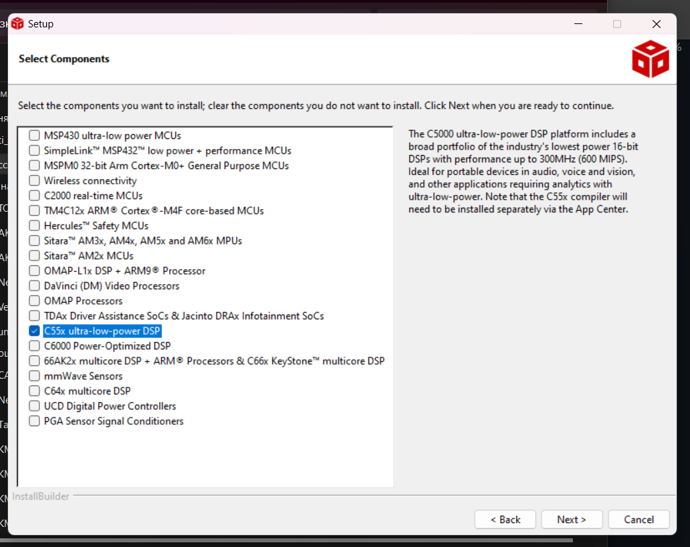

# CCS TI 安装与使用说明文档

## 如何安装用于旧版 C55 的 CCS TI

1. 从 [TI 官网](https://www.ti.com/tool/CCSTUDIO) 下载并安装最新版本（或从[附件文件](https://github.com/lab-iu6/TMS320C5515/blob/setup/установка/ccs_setup_12.8.1.00005.exe)安装）

   安装时只需选择 C55x ultra-low-power DSP 组件，如下图所示。
   

2. 下载并安装 [Code Generation Tools](https://github.com/lab-iu6/TMS320C5515/blob/setup/установка/ti_cgt_c5500_4.4.1_setup_win32.exe)（包含编译器、汇编器、链接器等）。

> [!NOTE]
> 安装文件位于 [setup](https://github.com/lab-iu6/TMS320C5515/tree/setup) 分支

## CodeComposerStudio 环境使用说明

主程序代码位于 `main.c` 文件中，位置如下图所示。
[图片]

如果需要打开代码中包含的文件，可以使用 `Open Declaration` 功能，先选中要查找的文件所在行。这样可以打开文件、查看选中函数的描述或选中变量的初始化（见下图）。
[图片]

### 项目结构

每个项目包含几个主要部分：

- **Binaries 部分** — 编译后将在此文件夹中生成二进制可执行文件 `*.out`

- **Includes 部分** — 列出了编译选项中包含的所有目录引用。列表会补充项目中提到的所有 `*.h` 和 `*.inc` 文件

- **Debug 部分** — 包含所有编译文件，包括 `*.map` 和 `*.obj`

### 项目操作

对于创建或导入的项目，你可以：

1. 点击"锤子"图标进行编译
   - 这个过程会构建项目并检查错误

2. 将代码加载到调试板中（即烧录）
   - 点击顶部面板的 `Run -> Load` 
   - 选择要烧录的项目

3. 在调试模式下运行程序
   - 用于监视变量值
   - 使用断点
   - 单步执行等
   - 点击顶部面板的"虫子"图标启动调试模式

### 打开现有项目

1. 点击左上角 `File -> Import`
2. 选择项目类型 `CCS Projects` 
3. 在文件系统中选择项目文件夹
